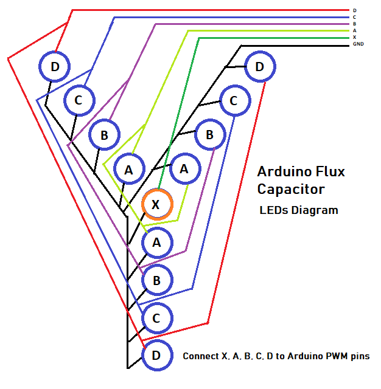

# Time Machine - Flux Capacitor


FluxCapacitor is an Arduino library to emulate Back to the Future **Flux Capacitor** lights for a scale model car.

This library is used to emulate the lightings of the Back to the Future Delorean Time Machine Flux Capacitor, to place it on a scale model car, using LEDs and an Arduino board.

If you like **FluxCapacitor**, give it a star, or fork it and contribute!

[](https://paypal.me/zerfoinder)

## Installation

1. Navigate to the Releases page.
1. Download the latest release.
1. In the Arduino IDE, navigate to Sketch > Include Library > Add .ZIP Library

## How it works

Flux Capacitor has 13 LED lights, one LED on center of the flux, and four (or five) groups of three LEDs. All of them create the lighting routine.
There are eigth "speed lighting levels". Each level has different flashing speed and brightness. Levels goes from level 1 to level 8.
When the flux is off, it is on level 0.
When the flux is turned on,  it is set to level 1.

### The Circuit



It is the responsibility of the user to generate the code that changes levels at desired time.

## Usage

```C++
#include <FluxCapacitor.h>   // Add include to FluxCapacitor.h

using namespace bttf::timemachine; // Add using namespace

// FluxCapacitor declaration
FluxCapacitor fluxCapacitor(3, 5, 6, 9, 10); // common PWM pins for many boards.

// Used to increase Flux Capacitor level every 3 seconds.
unsigned long _previousExecutionMillis = 0;

void setup() {
    fluxCapacitor.init();  // [REQUIRED] initialize the flux and pins.
}

void loop() {

    //  If flux is STOPPED then it is turned ON
    if (fluxCapacitor.state() == STOPPED) {
        fluxCapacitor.on();         // Flux capacitor ON
    }

    // Enter every 3 seconds
    if (millis() >= _previousExecutionMillis + 3000) {
        _previousExecutionMillis += 3000;

        // if flux level is 8, then turn it off
        if (fluxCapacitor.level() == 8) {
            fluxCapacitor.off();    // Flux capacitor OFF
        }

        // set flux capacitor to next level
        fluxCapacitor.next();
    }


    fluxCapacitor.loop(); // Call fluxCapacior.loop() ALWAYS in the end of sketch loop().
}
```

## Components and functions

### FluxCapacitor Class

#### Example

```C++
FluxCapacitor fluxCapacitor(3, 5, 6, 9, 10); // common PWM pins for many boards.
```

#### Public methods

| Method | Description |
| ---------- | ----------- |
| `FluxCapacitor(byte pinNumberCentral, byte pinNumberA, byte pinNumberB, byte pinNumberC);` | Constructor for 4 LEDs Flux. |
| `FluxCapacitor(byte pinNumberCentral, byte pinNumberA, byte pinNumberB, byte pinNumberC, byte pinNumberD);` | Constructor for 5 LEDs Flux. |
| `.init();` | Initialize flux capacitor, it should run always in setup() section. |
| `.on();`   | Turns on Flux Capacitor. |
| `.off();`  | Turns off Flux Capacitor. |
| `.flash();` | All Flux Capacitor LEDs flash for 200 milliseconds. |
| `.flash(unsigned long duration);` | All Flux Capacitor LEDs flash for specific milliseconds. |
| `.setValue(int value);`    | Set Flux Capacitor level (1-8). |
| `.next();`    | Set Flux Capacitor to next level. |
| `.level();`    | Returns the current Flux Capacitor level (1-8). |
| `.state();`    | Returns the current state of Flux Capacitor (STOPPED, RUNNING or FLASHING). |
| `.loop();`    | function used to manage concurrent actions. It should be ALWAYS added in the end of sketch loop() method. |

## Contributing

Pull requests are welcome. For major changes, please open an issue first to discuss what you would like to change.

[](https://paypal.me/zerfoinder)

## License

This library is licensed under [GPLv3](https://www.gnu.org/licenses/quick-guide-gplv3.html).
